# Network ATC Deep Dive

<!-- TOC -->

- [Network ATC Deep Dive](#network-atc-deep-dive)
    - [Prerequsites](#prerequsites)
    - [Understanding Network ATC commands](#understanding-network-atc-commands)
    - [Understanding Network ATC status and default values](#understanding-network-atc-status-and-default-values)
    - [Troubleshooting Network ATC](#troubleshooting-network-atc)
    - [Adjusting intents using overrides](#adjusting-intents-using-overrides)
    - [Resetting values back](#resetting-values-to-back)

<!-- /TOC -->

## Prerequsites

The main prerequisite is to have Azure Local or Windows Server 2025 cluster to play with. You can follow [Azure Local](../../lab-guides/01a-DeployAzureStackHCICluster-CloudBasedDeployment/readme.md) and [Windows Server](../../lab-guides/03-TestingWindowsServer2025/readme.md) deployement guides to create one.

You can also create following lab to play with Windows Server switchless

```PowerShell
$LabConfig=@{ DomainAdminName='LabAdmin'; AdminPassword='LS1setup!'; <#Prefix = 'WSLab-' ;#> DCEdition='4'; Internet=$true ; AdditionalNetworksConfig=@(); VMs=@()}

#Windows Server 2025
1..5 | ForEach-Object {$LABConfig.VMs += @{ VMName = "S2D$_" ; Configuration = 'S2D' ; ParentVHD = 'Win2025Core_G2.vhdx'; HDDNumber = 8; HDDSize= 4TB ; MemoryStartupBytes= 1GB ; MGMTNICs=6}} 

#Management machine
$LabConfig.VMs += @{ VMName = 'Management' ; ParentVHD='Win2025_G2.vhdx' ; MGMTNICs=1 ; AddToolsVHD=$True }
 
```
## Understanding Network ATC commands

If you made it into this guide, let's add more tips and tricks. All commands will be running from "Management" machine as it's a best practice for managing clusters at scale. Network ATC PowerShell modules needed to be copied from Azure Local (Azure Stack HCI) 21H2 into Windows Server 2022. Thankfully, Network ATC is included in Windows Server 2025.


```PowerShell
#First of all - you need to make sure, Network ATC is installed
Add-WindowsFeature -Name NetworkATC

#once NetATC is installed, PowerShell commands are available
Get-Command -Module NetworkATC

#identify avaliable clusters in Domain
    #first make sure failover clustering PowerShell module is installed
    Add-WindowsFeature -Name RSAT-Clustering-PowerShell
    #and now find s2d enabled clusters
    $Clusters=Get-Cluster -Domain $env:USERDOMAIN | Where-Object S2DEnabled -eq $True
    $Clusters.Name

#Grab Network ATC intents from Cluster(s)
$ClusterName="AXClus02"
Get-NetIntent -ClusterName $ClusterName

```

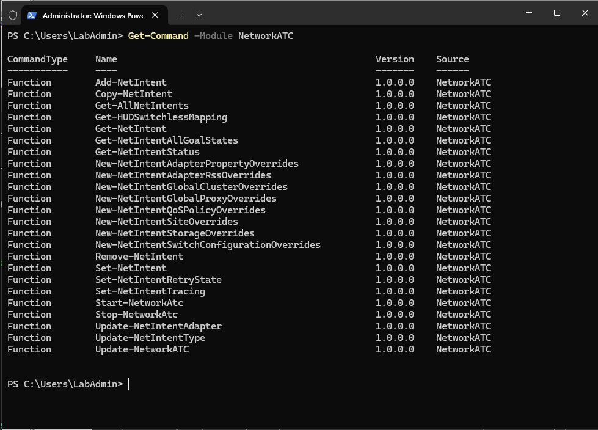

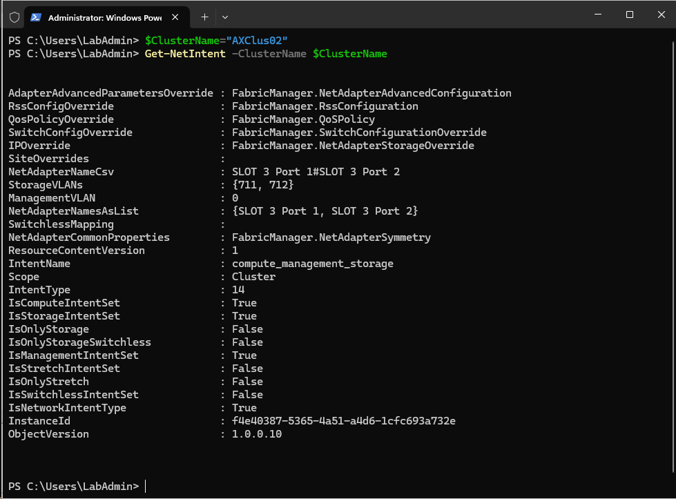

From screenshots above you can see, that there are quite some settings that we will go thru.

You can also notice that there are two new NetworkATC commands in Windows Server 2025 - **Get-HUDSwitchlessMapping** and **Update-NetIntentType**. Unfortunately both not documented https://learn.microsoft.com/en-us/powershell/module/networkatc/update-netintenttype?view=windowsserver2025-ps and https://learn.microsoft.com/en-us/powershell/module/networkatc/get-hudswitchlessmapping?view=windowsserver2025-ps


## Understanding Network ATC status and default values

Network Intent can be two types. Cluster and Server - so you can apply it on Server or entire cluster. There is a service, that applies the configuration and you can learn about how it went in the eventlog. 

There are also lot's of settings that NetworkATC can configure.

Let's explore it

```PowerShell
$ClusterName="AXClus02"

#make sure failover clustering powershell is installed and grab nodes
Install-WindowsFeature -Name RSAT-Clustering-PowerShell
$ClusterNodes=(Get-ClusterNode -Cluster $ClusterName).Name

#Check the status itself
Get-NetIntentStatus -ClusterName $ClusterName

#Check the service on nodes
get-service -ComputerName $ClusterNodes -Name NetworkATC

#check what was configured - Global NetIntent
    $NetIntentGlobal=Get-NetIntent -GlobalOverrides -ClusterName $ClusterName
    $NetIntentGlobal

    #Check Proxy settings
        $NetIntentGlobal.ProxyOverride
        Invoke-Command -ComputerName $ClusterNodes -ScriptBlock {netsh winhttp show proxy}

    #Check Cluster settings
        $NetIntentGlobal.ClusterOverride
        #check Cluster Network Names
        Get-ClusterNetwork -Cluster $ClusterName
        #check Live Migration Networks (what networks are excluded)
        Get-ClusterResourceType -Cluster $clustername -Name "Virtual Machine" | Get-ClusterParameter -Name MigrationExcludeNetworks | Format-Table  @{Label="Name"; Expression={(Get-ClusterNetwork -Cluster $ClusterName | Where-Object ID -eq $_.Value)}}
        #check "UseAnyNetworkForMigration" setting
        get-vmhost -CimSession $ClusterNodes | Select Name,UseAnyNetworkForMigration
        #check LiveMigration performance setting
        get-vmhost -CimSession $ClusterNodes | Select-Object Name,VirtualMachineMigrationPerformanceOption
        #check number of live migrations
        get-vmhost -CimSession $ClusterNodes | Select Name,MaximumVirtualMachineMigrations
        #check SMB Bandwidth limit
        Get-SmbBandwidthLimit -Category LiveMigration -CimSession $ClusterNodes


#check what was configured - NetIntent
    $NetIntent=Get-NetIntent -ClusterName $ClusterName

    #Global settings
        $NetIntent
        #NetAdapters
        Get-VMSwitch -CimSession $ClusterNodes | Format-Table Name,ComputerName,@{
            Label="NetAdapters"
            Expression=
                {
                    $AdapterDescriptions=$_.NetAdapterInterfaceDescriptions 
                    Foreach($AdapterDescription in $AdapterDescriptions){
                        (Get-NetAdapter -CimSession $_.ComputerName | Where-Object InterfaceDescription -eq $AdapterDescription).Name
                    }
                }
            }
        #StorageVLANs
        Get-VMNetworkAdapterIsolation -CimSession $ClusterNodes -ManagementOS | Where-Object ParentAdapter -like *vSMB* | Select-Object ComputerName,DefaultIsolationID

    #Common Properties
        $netintent.NetAdapterCommonProperties
        #LinkSpeed
        get-netadapter -CimSession $ClusterNodes | Select Name,Linkspeed
        #ComponentID
        get-netadapter -CimSession $ClusterNodes | Select Name,ComponentID

    #AdapterAdvancedProperty
        $netintent.AdapterAdvancedParametersOverride
        #grab all adapters advanced properties
        Get-NetAdapterAdvancedProperty -CimSession $ClusterNodes | Sort-Object Name,DisplayName

    #RssConfig
        $NetIntent.RssConfigOverride
        #grab all adapters RSS config
        Get-NetAdapterRss -CimSession $ClusterNodes

    #QoS Policy
        $NetIntent.QosPolicyOverride
        #Priorities and NetDirectPortMatchCondition
        Get-NetQosPolicy -CimSession $ClusterNodes | Select PSComputerName,Name,PriorityValue,NetDirectPort
        #Bandwidth Percentages
        Get-NetAdapterQos -CimSession $ClusterNodes

    #SwitchConfig
        $netIntent.SwitchConfigOverride
        #RSC Settings
        Get-VMSwitch -CimSession $ClusterNodes | Select Name,ComputerName,SoftwareRscEnabled
        #Vrss settings
        Get-VMSwitch -CimSession $ClusterNodes | Select Name,ComputerName,*Vrss*
        #IOV
        Get-VMSwitch -CimSession $ClusterNodes | Select Name,ComputerName,*Iov*
        #embedded teaming/Loadbalancing
        Get-VMSwitchTeam -CimSession $ClusterNodes 


```

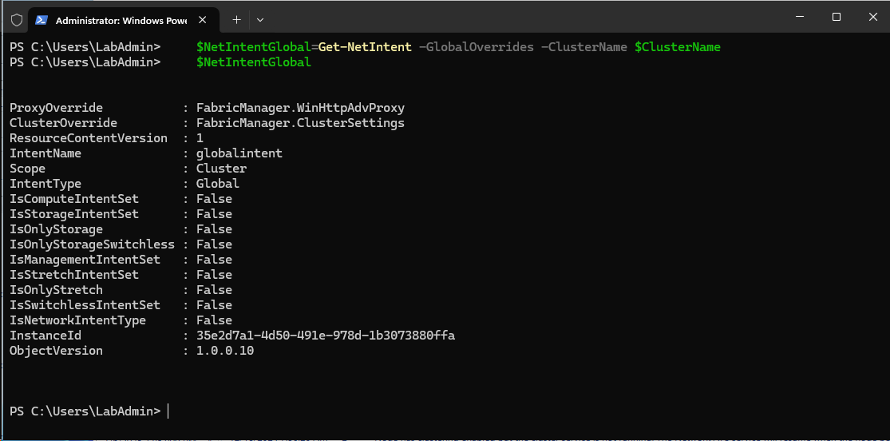

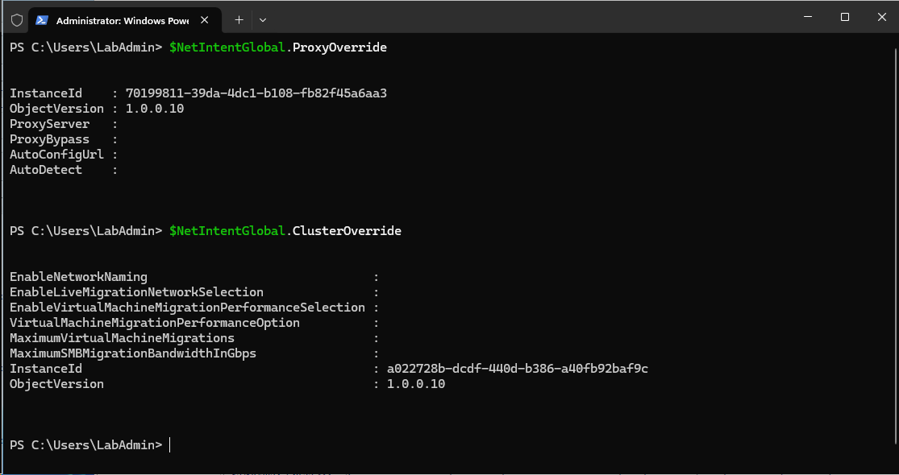

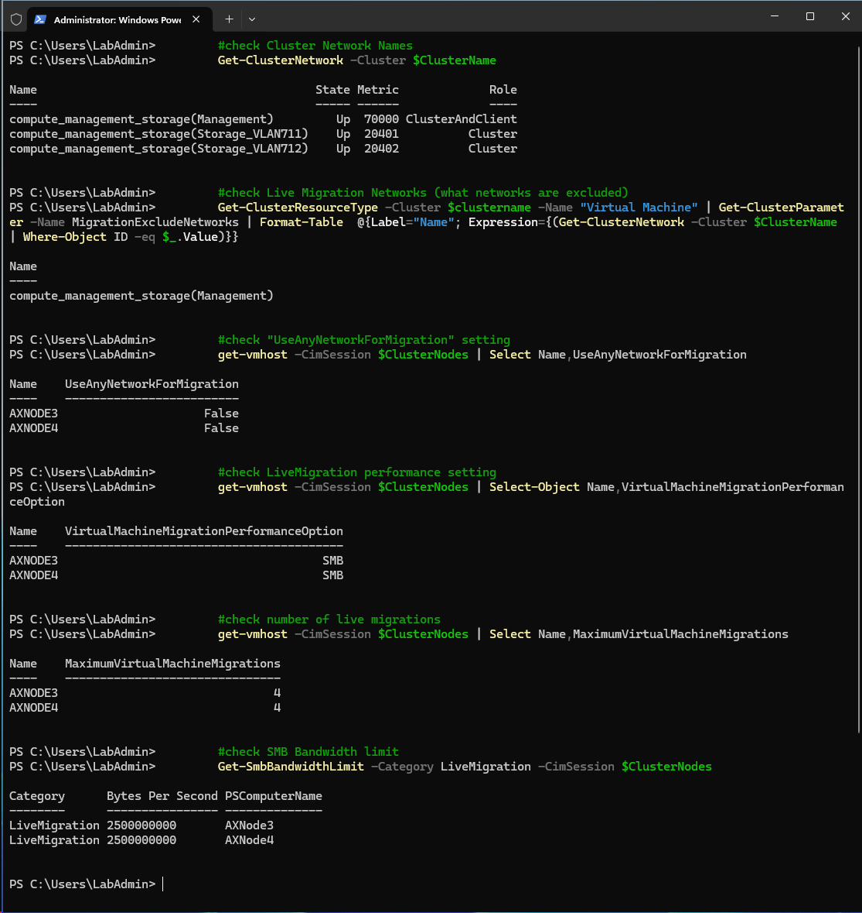

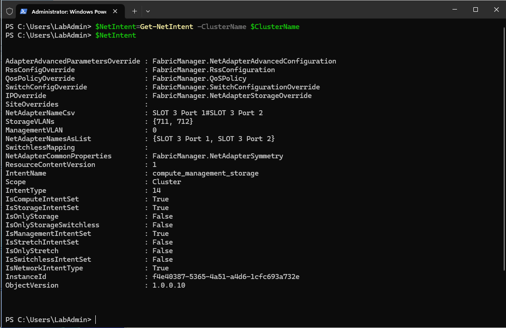

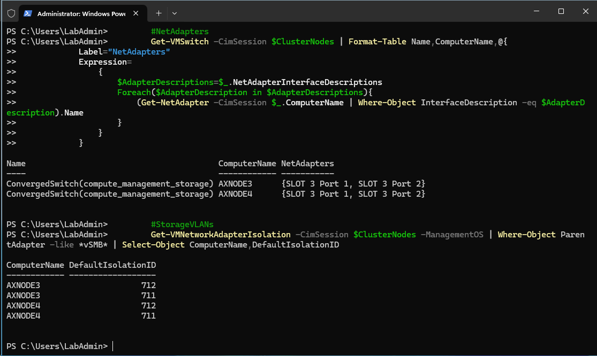

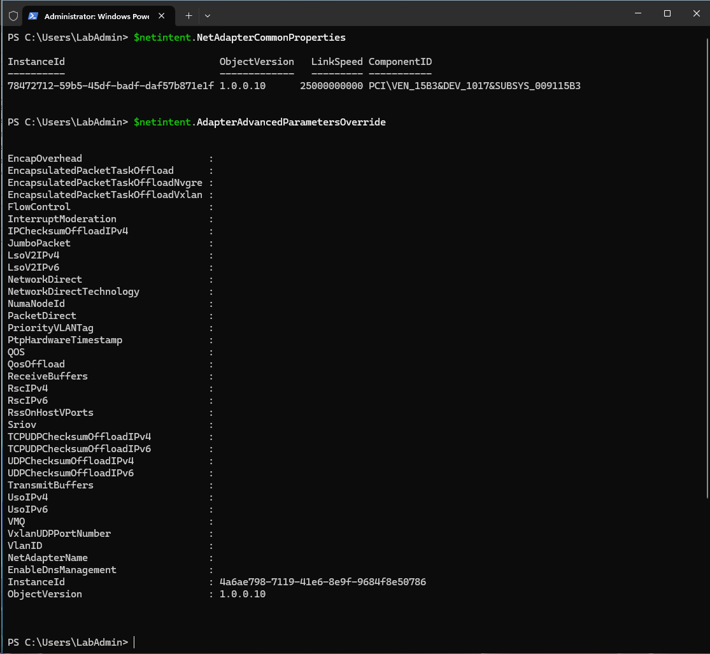

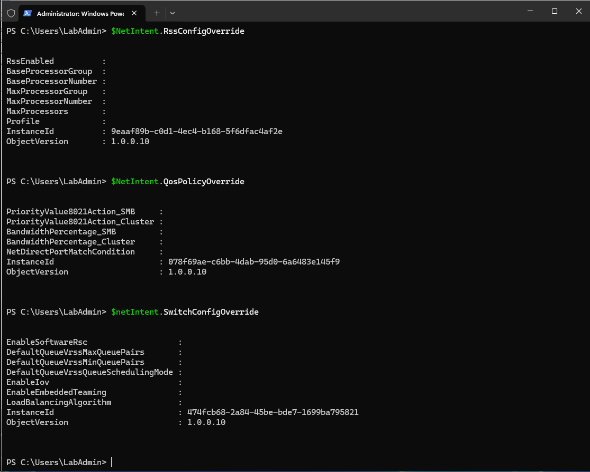

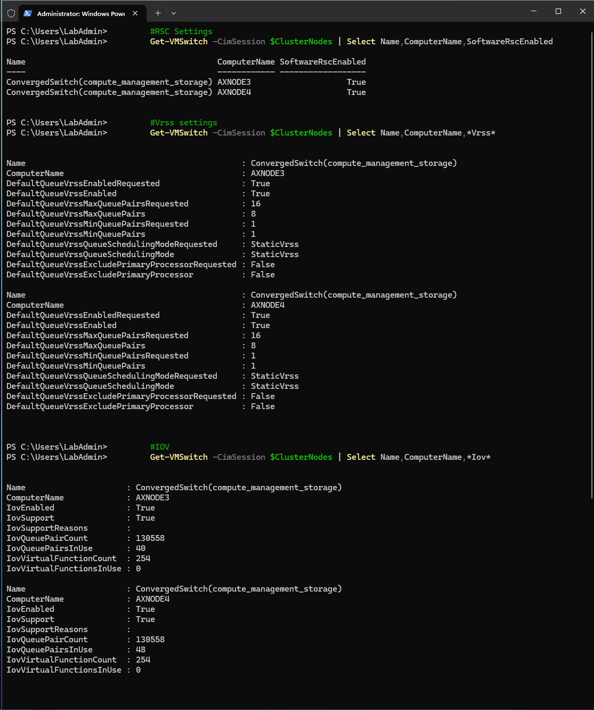

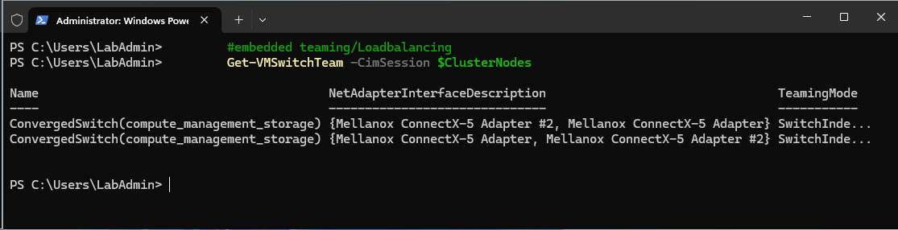

## Troubleshooting Network ATC

```PowerShell
$ClusterName="AXClus02"

#make sure failover clustering powershell and NetworkATC is installed and grab nodes
Install-WindowsFeature -Name RSAT-Clustering-PowerShell,NetworkATC
$ClusterNodes=(Get-ClusterNode -Cluster $ClusterName).Name

#Check the status itself
Get-NetIntentStatus -ClusterName $ClusterName

#Check the service on nodes
get-service -ComputerName $ClusterNodes -Name NetworkATC

#check event log https://learn.microsoft.com/en-us/powershell/scripting/samples/creating-get-winevent-queries-with-filterhashtable?view=powershell-7.4
#you can list logs with following command
#get-winevent -ListLog * -ComputerName $ClusterNodes[0]
Invoke-command -ComputerName $ClusterNodes -ScriptBlock {Get-WinEvent -FilterHashtable @{LogName="Microsoft-Windows-Networking-NetworkAtc/Operational"}  -MaxEvents 100 }| Select TimeCreated,Level,Message,LogName,PSComputerName | Out-Gridview -Title "NetATC Operational"
Invoke-command -ComputerName $ClusterNodes -ScriptBlock {Get-WinEvent -FilterHashtable @{LogName="Microsoft-Windows-Networking-NetworkAtc/Admin"}  -MaxEvents 100 }| Select TimeCreated,Level,Message,LogName,PSComputerName | Out-Gridview -Title "NetATC Admin"

```

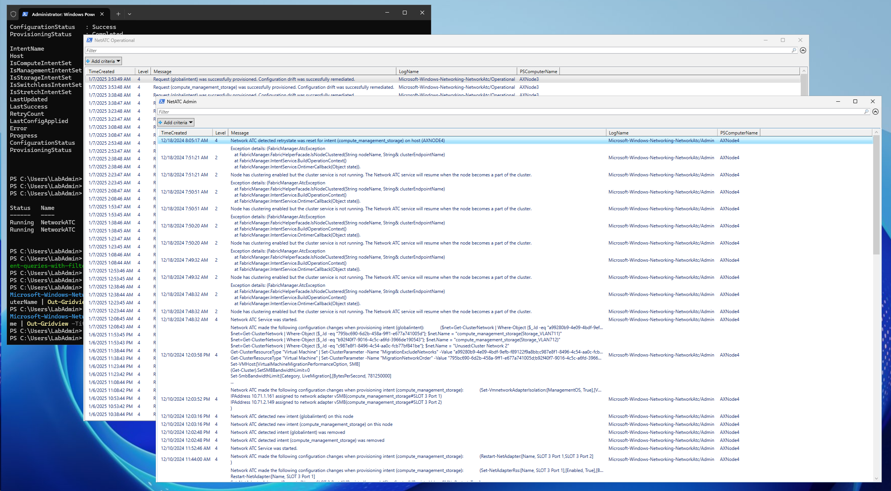

## Adjusting intents using overrides

Let's adjust number of live migrations and Live migration speed as I think this might be the the most often changed value

```PowerShell
$ClusterName="AXClus02"

#Adjusting Global Overrides
    #to adjust LM settings you need to apply global override
    $override=New-NetIntentGlobalClusterOverrides
    $override
    $override.MaximumSMBMigrationBandwidthInGbps=20
    $override.MaximumVirtualMachineMigrations=4
    Set-NetIntent -GlobalClusterOverrides $override -ClusterName $ClusterName
    #check net intent
    Get-NetIntent -GlobalOverrides -ClusterName $ClusterName

#adjusting storage intent
    $IntentName=(Get-NetIntent -ClusterName $ClusterName | Where-Object IsStorageIntentSet).IntentName
    #adjust Storage VLANs
    Set-NetIntent -Name $IntentName -ClusterName $ClusterName -StorageVlans 713,714
    #adjust AdapterAdvanced property - MTU Size
    $override=New-NetIntentAdapterPropertyOverrides
    $override.JumboPacket=9014
    Set-NetIntent -Name $IntentName -ClusterName $ClusterName -AdapterPropertyOverrides $override


#wait intent to finish applying
Write-Output "waiting for intent"
do {
    Write-Host "." -NoNewline
    Start-Sleep 5
    $status=Get-NetIntentStatus -ClusterName $ClusterName
} while ($status.ConfigurationStatus -contains "Provisioning" -or $status.ConfigurationStatus -contains "Retrying")

#check settings
get-netintent -ClusterName $ClusterName
(get-netintent -ClusterName $ClusterName).AdapterAdvancedParametersOverride

#check log
Invoke-command -ComputerName $ClusterNodes -ScriptBlock {Get-WinEvent -FilterHashtable @{LogName="Microsoft-Windows-Networking-NetworkAtc/Admin"}  -MaxEvents 100 }| Select TimeCreated,Level,Message,LogName,PSComputerName | Out-Gridview -Title "NetATC Admin"

```

## Resetting values back

```PowerShell
$ClusterName="AXClus02"

$IntentName=(Get-NetIntent -ClusterName $ClusterName | Where-Object IsStorageIntentSet).IntentName
$override=New-NetIntentAdapterPropertyOverrides
#unfortunately you cannot "remove" the value. You need to set new (if you did find how, PR please!)
$override.JumboPacket=1514
Set-NetIntent -Name $IntentName -ClusterName $ClusterName -AdapterPropertyOverrides $override
Set-NetIntent -Name $IntentName -ClusterName $ClusterName -StorageVlans 711,712

#wait intent to finish applying
Write-Output "waiting for intent"
do {
    Write-Host "." -NoNewline
    Start-Sleep 5
    $status=Get-NetIntentStatus -ClusterName $ClusterName
} while ($status.ConfigurationStatus -contains "Provisioning" -or $status.ConfigurationStatus -contains "Retrying")

#check settings
get-netintent -ClusterName $ClusterName
(get-netintent -ClusterName $ClusterName).AdapterAdvancedParametersOverride

#check log
Invoke-command -ComputerName $ClusterNodes -ScriptBlock {Get-WinEvent -FilterHashtable @{LogName="Microsoft-Windows-Networking-NetworkAtc/Admin"}  -MaxEvents 100 }| Select TimeCreated,Level,Message,LogName,PSComputerName | Out-Gridview -Title "NetATC Admin"
 
```

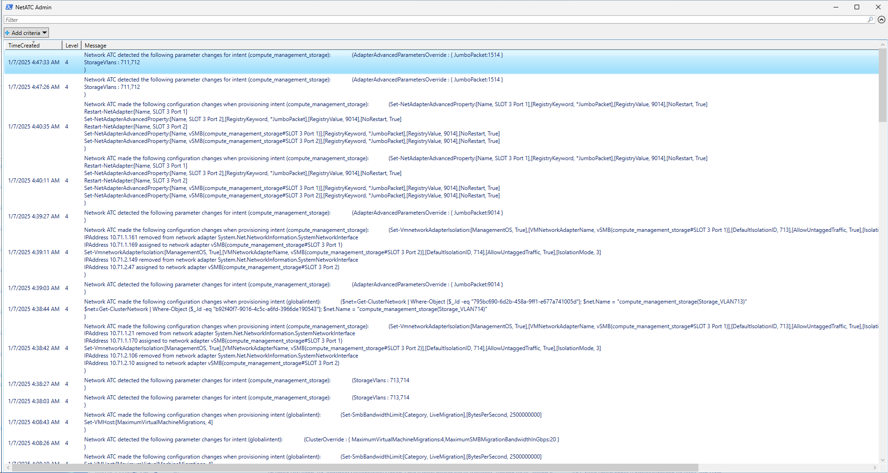