# Connecting to Azure Resource Bridge

## Connecting using SSH

```PowerShell
$ClusterName="AXClus02"

#just make Cluster PowerShell module is installed
Add-WindowsFeature -Name RSAT-Clustering-PowerShell

#grab servers
$Servers=(Get-ClusterNode -Cluster $ClusterName).Name
#generate key path
$KeyPath="\\$ClusterName\ClusterStorage`$\Infrastructure_1\Shares\SU1_Infrastructure_1\MocArb\WorkingDirectory\Appliance\Kva\logkey"
#grab IP
$IPAddress=(Get-VMNetworkAdapter -VMName *control-plane* -CimSession $Servers).IPAddresses | Select -First 1
#SSH
ssh -i $KeyPath clouduser@$IPAddress
 
```

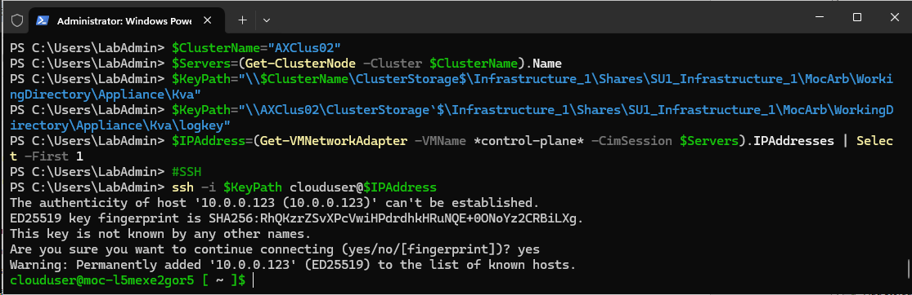

## Connecting using AZ

```PowerShell
#install az cli and log into az
    Start-BitsTransfer -Source https://aka.ms/installazurecliwindows -Destination $env:userprofile\Downloads\AzureCLI.msi
    Start-Process msiexec.exe -Wait -ArgumentList "/I  $env:userprofile\Downloads\AzureCLI.msi /quiet"
    #add az to enviromental variables so no posh restart is needed
    [System.Environment]::SetEnvironmentVariable('PATH',$Env:PATH+';C:\Program Files (x86)\Microsoft SDKs\Azure\CLI2\wbin')

    #login with device authentication
    az login --use-device-code

#add extension
az extension add --name arcappliance

```

## display resource bridge

```PowerShell
$ClusterName="AXClus02"
$ResourceGroupName="AXClus02-RG"
$ResourceBridgeName="$ClusterName-arcbridge"

#show
$Output=az arcappliance show --resource-group $ResourceGroupName --name $ResourceBridgeName | Convertfrom-json
$Output
 
```

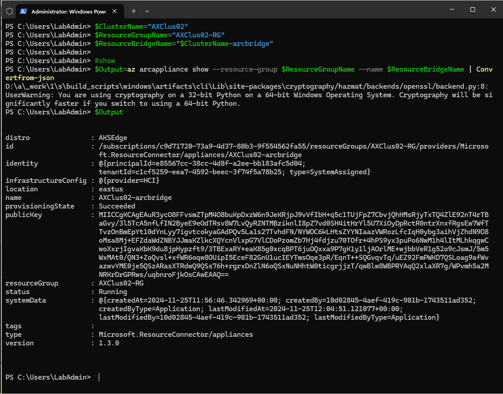


# Advanced operations

https://learn.microsoft.com/en-us/azure/azure-arc/resource-bridge/maintenance
https://learn.microsoft.com/en-us/azure/azure-arc/resource-bridge/troubleshoot-resource-bridge


## Enable CredSSP

```PowerShell
#first you need to delegate permissions
    $ClusterName="AXClus02"

    $CredSSPServers=$ClusterName

    #Configure CredSSP First
        #since just Enable-WSMANCredSSP no longer works in WS2025, let's configure it via registry
            $key = 'hklm:\SOFTWARE\Policies\Microsoft\Windows\CredentialsDelegation'
            if (!(Test-Path $key)) {
                New-Item $key
            }
        
            #New-ItemProperty -Path $key -Name AllowFreshCredentialsWhenNTLMOnly -Value 1 -PropertyType Dword -Force
            #New-ItemProperty -Path $key -Name AllowFreshCredentials -Value 1 -PropertyType Dword -Force
        
            $keys = 'hklm:\SOFTWARE\Policies\Microsoft\Windows\CredentialsDelegation\AllowFreshCredentialsWhenNTLMOnly','hklm:\SOFTWARE\Policies\Microsoft\Windows\CredentialsDelegation\AllowFreshCredentials'
            foreach ($Key in $keys){
                if (!(Test-Path $key)) {
                    New-Item $key
                }
        
                $i=1
                foreach ($Server in $CredSSPServers){
                    New-ItemProperty -Path $key -Name $i -Value "WSMAN/$Server" -PropertyType String -Force
                    $i++
                }
            }

        #Enable CredSSP Server on remote machine
        Invoke-Command -ComputerName $CredSSPServers -ScriptBlock { Enable-WSManCredSSP Server -Force }

    #Send command to remote server/or enter-pssession
    #Invoke-Command -ComputerName $ClusterName -Credential $Credentials -Authentication Credssp -ScriptBlock {}


    #Disable CredSSP
    <#
        #Disable-WSManCredSSP -Role Client
        Remove-Item -Path 'hklm:\SOFTWARE\Policies\Microsoft\Windows\CredentialsDelegation' -Recurse
        Invoke-Command -ComputerName $CredSSPServers -ScriptBlock {Disable-WSManCredSSP Server}
    #>

```


## remove resource bridge (!DON'T DO THIS! It will completely break ARB!)

```PowerShell
    $ClusterName="AXClus02"
    #Create Credentials
        $CredSSPUserName="Corp\LabAdmin"
        $CredSSPPassword="LS1setup!"
        $SecureStringPassword = ConvertTo-SecureString $CredSSPPassword -AsPlainText -Force
        $Credentials = New-Object System.Management.Automation.PSCredential ($CredSSPUserName, $SecureStringPassword)
        #or just 
        #Credentials=Get-Credential

    Enter-PSSession -ComputerName $ClusterName -Credential $Credentials -Authentication Credssp
        $yaml="c:\ClusterStorage\Infrastructure_1\Shares\SU1_Infrastructure_1\MocArb\WorkingDirectory\Appliance\hci-appliance.yaml"
        #login with device authentication
        az login --use-device-code

        #select subscription
        $SubscriptionID="c9d71720-73a9-4d37-80b3-9f554562fa55"
        az account set -s $SubscriptionID

        #delete appliance
        az arcappliance delete hci --config-file $yaml --yes
    exit
```

before

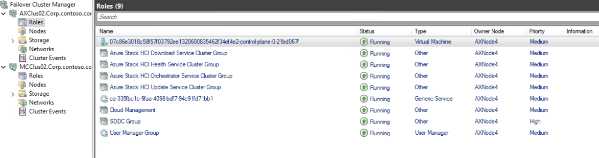

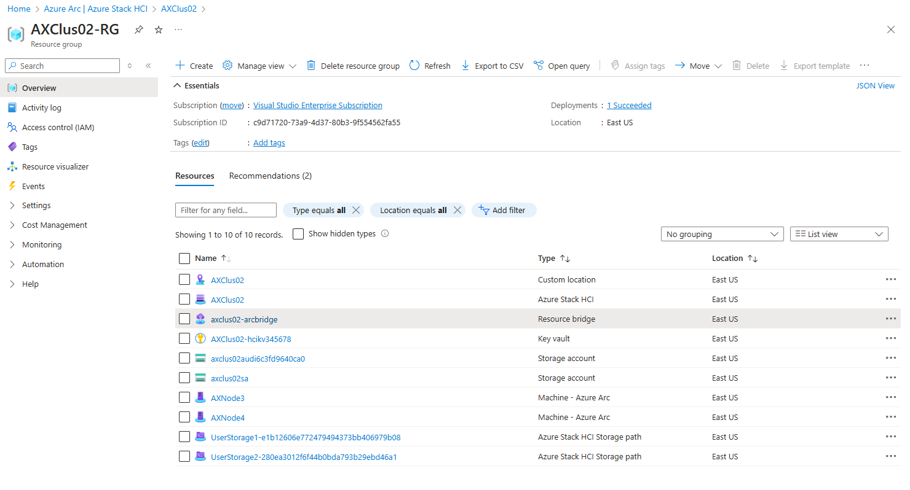

after

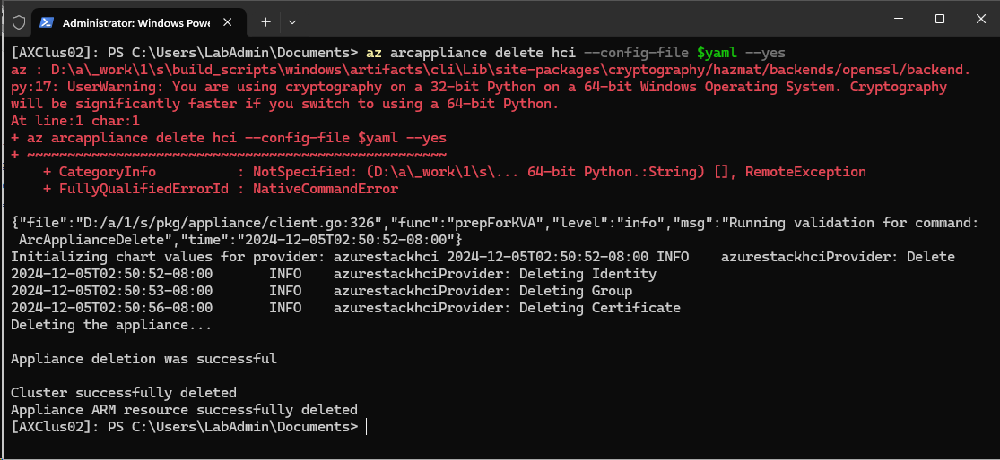

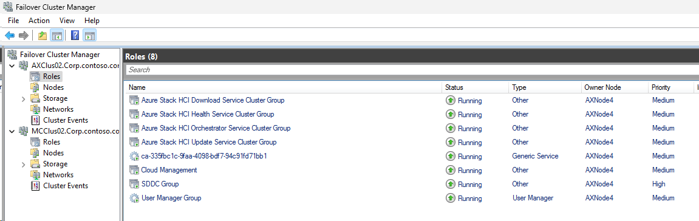

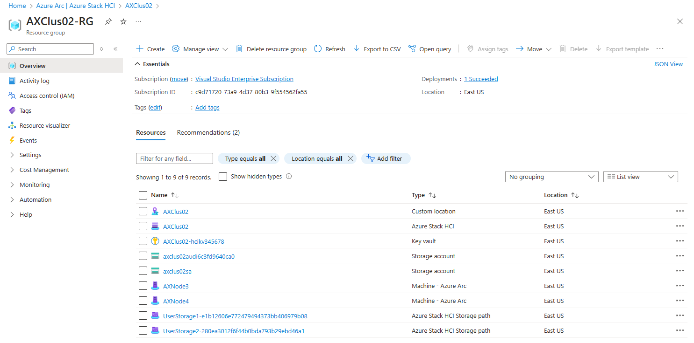

## add resource bridge back

```PowerShell
    $ClusterName="AXClus02"
    #Create Credentials
        $CredSSPUserName="Corp\LabAdmin"
        $CredSSPPassword="LS1setup!"
        $SecureStringPassword = ConvertTo-SecureString $CredSSPPassword -AsPlainText -Force
        $Credentials = New-Object System.Management.Automation.PSCredential ($CredSSPUserName, $SecureStringPassword)
        #or just 
        #Credentials=Get-Credential


    Enter-PSSession -ComputerName $ClusterName -Credential $Credentials -Authentication Credssp
        $yaml="c:\ClusterStorage\Infrastructure_1\Shares\SU1_Infrastructure_1\MocArb\WorkingDirectory\Appliance\hci-appliance.yaml"
        $kubeconfig="c:\ClusterStorage\Infrastructure_1\Shares\SU1_Infrastructure_1\MocArb\WorkingDirectory\Appliance\kubeconfig"
        #login with device authentication
        az login --use-device-code

        #select subscription
        $SubscriptionID="c9d71720-73a9-4d37-80b3-9f554562fa55"
        az account set -s $SubscriptionID

        #prepare appliance
        az arcappliance prepare hci --config-file $yaml
        #deploy
        az arcappliance deploy hci --config-file $yaml

        #connect appliance
        
        az arcappliance create hci --config-file $yaml --kubeconfig $kubeconfig

    exit

```

and VM is back

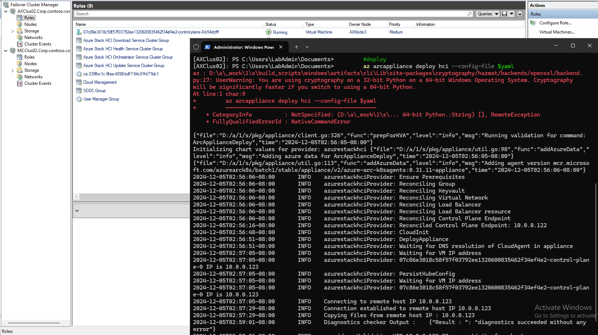

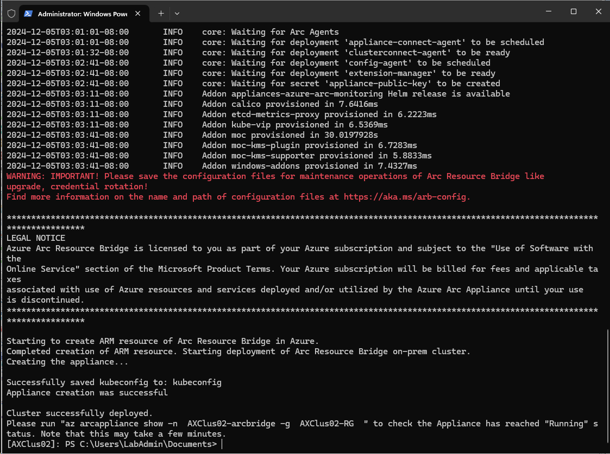

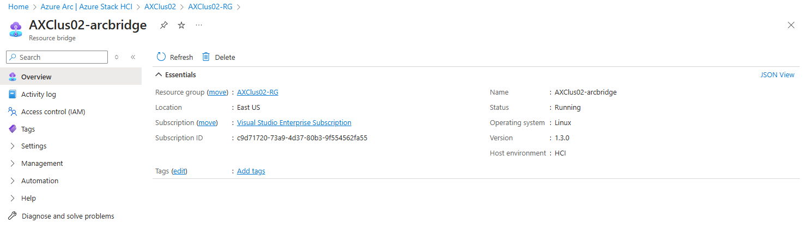

!!!but it's completely broken!!!

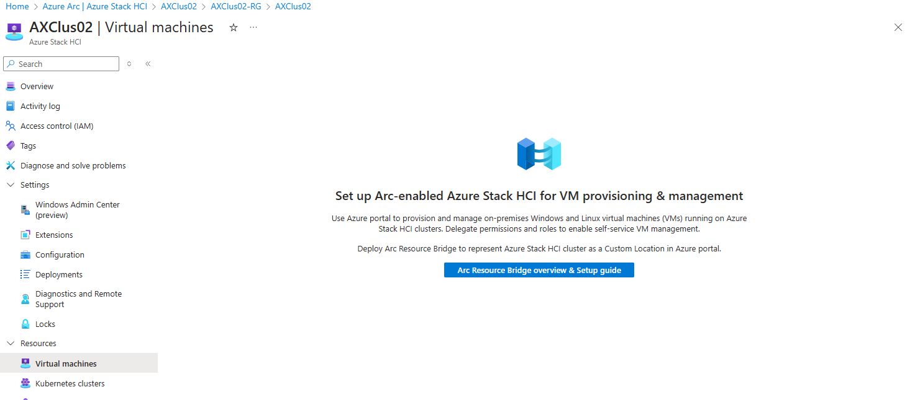


